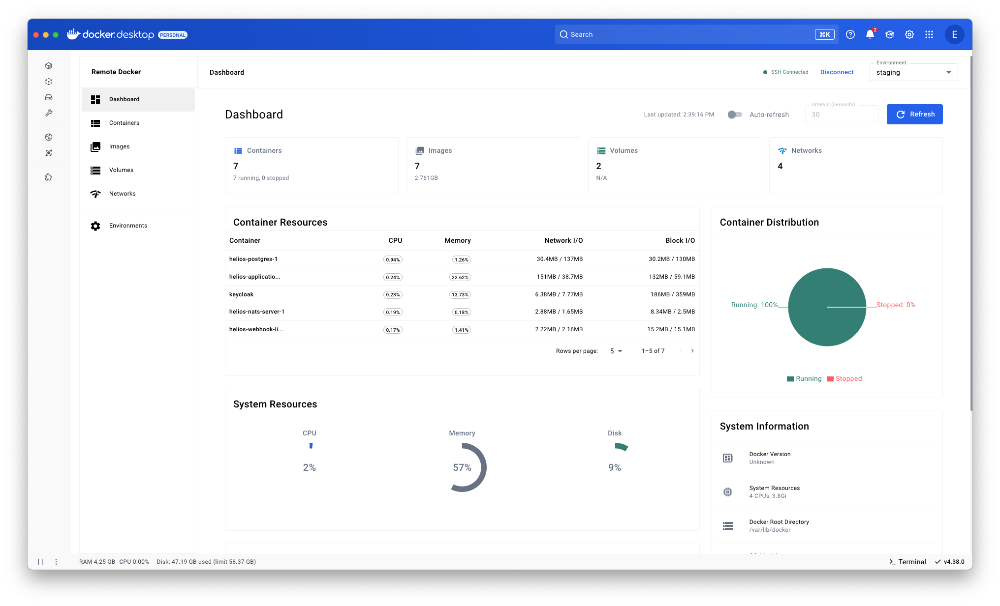
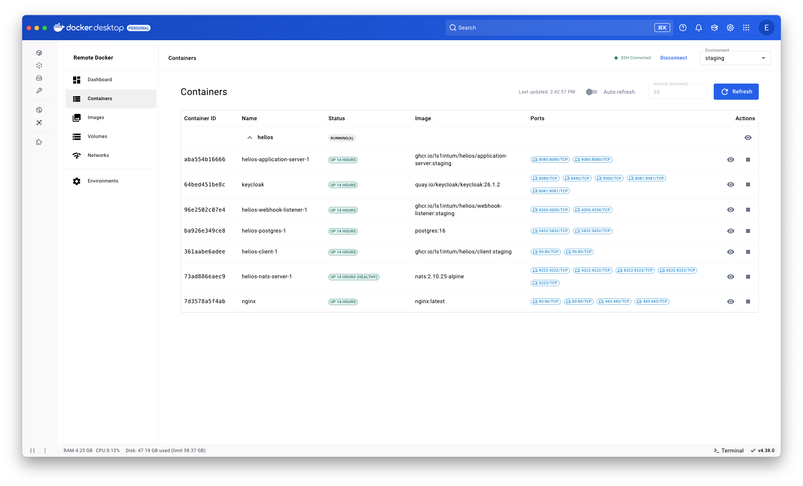
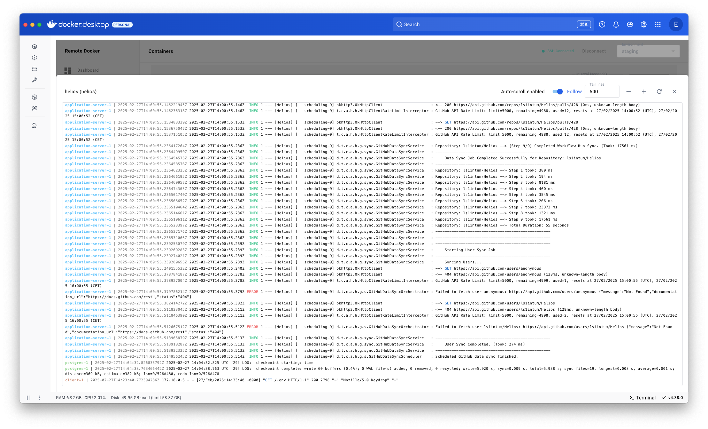
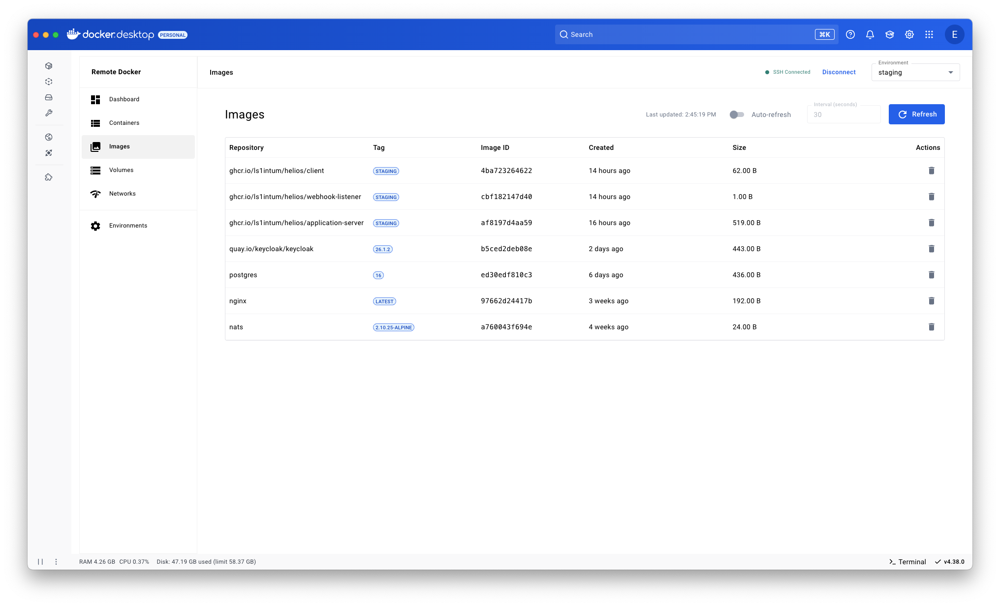
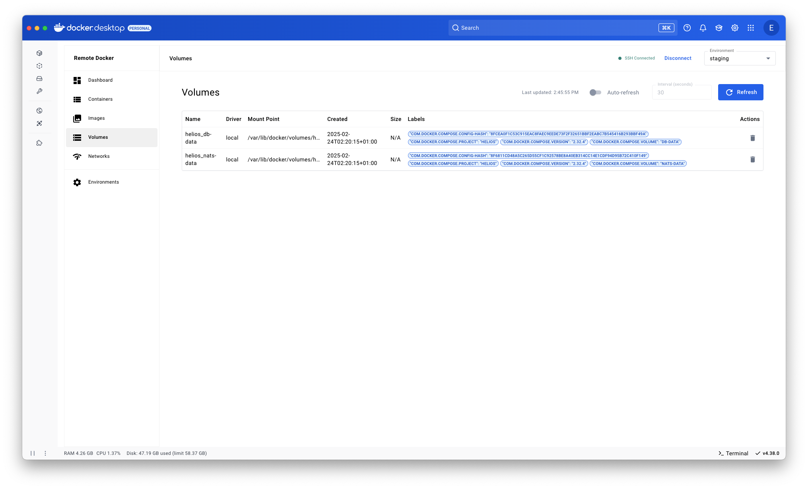
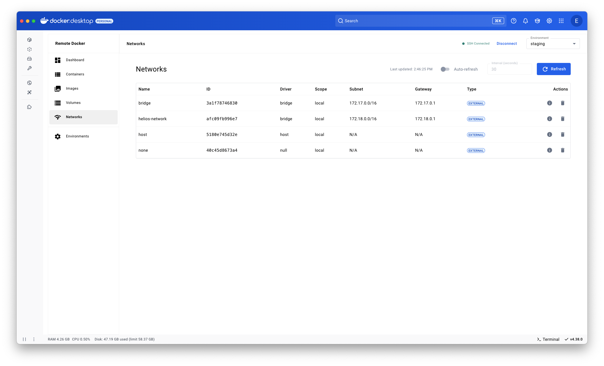
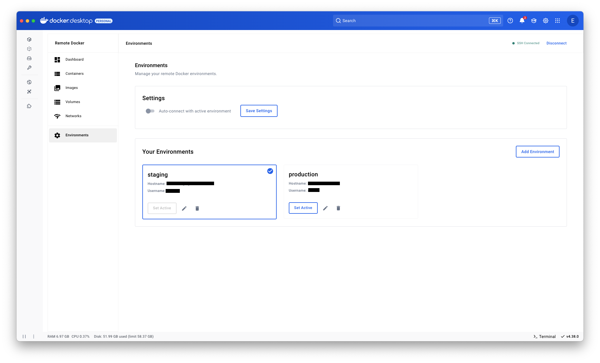
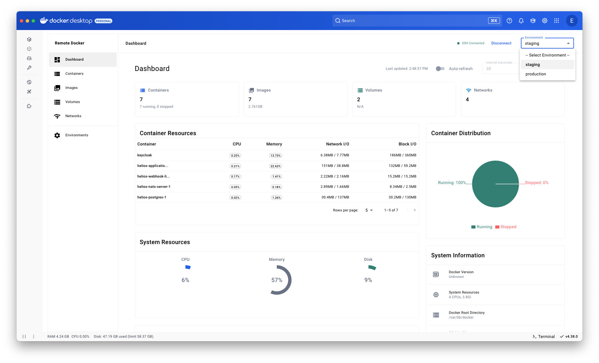

# Remote Docker Desktop Extension

<p align="center">
  
</p>

<p align="center">
  <strong>Manage remote Docker environments directly from Docker Desktop</strong>
</p>

<p align="center">
  <a href="https://hub.docker.com/r/telkombe/remote-docker">
    
  </a>
  <a href="https://github.com/anubissbe/remote-docker/blob/main/LICENSE">
    
  </a>
  <a href="https://github.com/anubissbe/remote-docker/releases">
    
  </a>
</p>

<p align="center">
  <a href="https://github.com/anubissbe/remote-docker/actions/workflows/test.yml">
    
  </a>
  <a href="https://github.com/anubissbe/remote-docker/actions/workflows/security.yml">
    
  </a>
  <a href="https://github.com/anubissbe/remote-docker">
    
  </a>
</p>

<p align="center">
  <a href="https://github.com/anubissbe/remote-docker/stargazers">
    
  </a>
  <a href="https://github.com/anubissbe/remote-docker/network/members">
    
  </a>
  <a href="https://github.com/anubissbe/remote-docker/issues">
    
  </a>
</p>

## Overview

🚀 **Remote Docker** is a powerful Docker Desktop extension that revolutionizes how you manage remote Docker environments. Connect securely to any Docker host through SSH tunnels and enjoy the familiar Docker Desktop experience, whether your containers are running locally or on remote servers across the globe.

<div align="center">

[](https://hub.docker.com/r/telkombe/remote-docker)
[](https://hub.docker.com/r/telkombe/remote-docker)
[](https://hub.docker.com/r/telkombe/remote-docker)
[](https://www.docker.com/products/docker-desktop/)
[](https://github.com/anubissbe/remote-docker#security)

</div>

> **Perfect for developers, DevOps engineers, and system administrators** who need to manage multiple Docker environments from a single, unified interface.

**Why Remote Docker?**
- 🌐 **Bridge the gap** between local development and remote production environments
- 🔒 **Enterprise-grade security** with SSH key authentication
- ⚡ **Real-time monitoring** of remote Docker resources and performance
- 🎯 **Zero configuration** - works with any Docker host that supports SSH
- 📱 **Seamless integration** with Docker Desktop's native UI and workflows

### ✨ Key Features

<table>
<tr>
<td width="50%">

🔐 **Secure SSH Connections**
- SSH key-based authentication only
- No passwords or tokens stored
- Encrypted tunnel for all communication

🖥️ **Multi-Environment Support**
- Manage unlimited remote environments
- Quick environment switching
- Persistent configuration storage

📊 **Real-time Dashboard**
- Live system resource monitoring
- Container statistics and metrics
- Docker events streaming

</td>
<td width="50%">

🐳 **Complete Docker Management**
- Containers: start, stop, restart, logs
- Images: list, inspect, remove
- Networks: view, create, delete
- Volumes: browse, inspect, cleanup

🔄 **Smart Auto-refresh**
- Configurable refresh intervals
- Selective data updates
- Visual refresh indicators

🎨 **Professional UI**
- Native Docker Desktop integration
- Dark/light theme support
- Responsive design for all screen sizes

</td>
</tr>
</table>

## Installation

### From Docker Hub

```bash
docker extension install telkombe/remote-docker:latest
```

### Manual Installation

```bash
# Clone the repository
git clone https://github.com/anubissbe/remote-docker.git
cd remote-docker

# Build and install locally
make build
docker extension install telkombe/remote-docker:latest
```

## Quick Start

1. **Install the extension** from Docker Hub
2. **Open the extension** in Docker Desktop
3. **Add a remote environment**:
   - Click "Add Environment"
   - Enter a name for your environment
   - Provide the SSH connection details:
     - Hostname: Your remote Docker host (e.g., `192.168.1.25`)
     - Username: SSH username (e.g., `ubuntu`)
     - Port: SSH port (default: 22)
4. **Connect** to start managing your remote Docker environment

## Requirements

### Local Machine
- Docker Desktop 4.8.0 or later
- SSH key pair for authentication

### Remote Host
- Docker Engine installed and running
- SSH server with key-based authentication enabled
- User with Docker permissions (typically in the `docker` group)

## SSH Key Setup

The extension uses SSH key authentication for secure connections. Your SSH keys are automatically mounted from your local `.ssh` directory.

### Windows
```powershell
# Keys are read from
C:\Users\<username>\.ssh\id_rsa
C:\Users\<username>\.ssh\id_rsa.pub
```

### macOS/Linux
```bash
# Keys are read from
~/.ssh/id_rsa
~/.ssh/id_rsa.pub
```

### Setting up SSH Keys

1. **Generate SSH keys** (if you don't have them):
   ```bash
   ssh-keygen -t rsa -b 4096
   ```

2. **Copy your public key to the remote host**:
   ```bash
   ssh-copy-id username@remote-host
   ```

3. **Test the connection**:
   ```bash
   ssh username@remote-host docker version
   ```

## Features in Detail

### Dashboard
- System information and Docker version
- Resource utilization (CPU, Memory, Disk)
- Container statistics and distribution
- Recent Docker events
- Real-time metrics with auto-refresh

### Container Management
- View all containers with status
- Start/stop containers
- View container logs with syntax highlighting
- Port mapping information
- Docker Compose project grouping

### Image Management
- List all images with size information
- Remove unused images
- View image details and layers

### Network Management
- List Docker networks
- View network configuration
- Delete unused networks

### Volume Management
- List Docker volumes
- View volume details
- Remove unused volumes

## Configuration

### Environment Settings
Each environment can be configured with:
- **Name**: Friendly name for the environment
- **Hostname**: IP address or domain name
- **Port**: SSH port (default: 22)
- **Username**: SSH username

### Auto-refresh Settings
- Enable/disable auto-refresh per view
- Configurable refresh intervals (15s, 30s, 60s, 300s)
- Visual indicators for refresh status

## Security

- **SSH Key Authentication**: Only SSH key authentication is supported (no passwords)
- **Local Key Storage**: SSH keys remain on your local machine
- **Read-only Mounts**: Keys are mounted read-only in the extension container
- **No Keys in Images**: Docker images do not contain any SSH keys
- **Secure Tunneling**: All Docker API communication goes through SSH tunnels

## Architecture

### Components

The extension consists of two main parts:

1. **Backend (Go)**
   - Handles SSH tunnel creation and management
   - Proxies Docker commands to remote hosts
   - Built with Echo framework

2. **Frontend (React/TypeScript)**
   - Provides a UI for remote Docker management
   - Features a responsive dashboard with real-time updates
   - Built with Material UI components and Recharts for data visualization

### How It Works

1. The extension mounts your local `~/.ssh` directory as read-only
2. When you connect to a remote environment, it creates an SSH tunnel
3. Docker commands are proxied through the tunnel to the remote Docker daemon
4. Results are displayed in the familiar Docker Desktop UI

## Troubleshooting

### Common Issues

#### "Permission denied" SSH Error
- Ensure your SSH key has proper permissions (600 on Unix-like systems)
- Verify the remote user is in the `docker` group
- Check SSH key is correctly added to remote host's `authorized_keys`

#### Blank Screen on Extension Load
- Check Docker Desktop console for errors (View → Developer Tools)
- Ensure Docker Desktop is up to date
- Try reinstalling the extension

#### Cannot Connect to Remote Host
- Verify SSH connection works: `ssh username@hostname`
- Check Docker is running on remote: `ssh username@hostname docker ps`
- Ensure no firewall is blocking SSH port

### Debug Mode

Enable debug logging in the extension:
1. Open Docker Desktop Developer Tools
2. Check console for detailed error messages
3. Look for API response errors

## Development

See [docs/development.md](docs/development.md) for development setup and contribution guidelines.

### Project Structure

```
remote-docker/
├── backend/          # Go backend service
├── ui/              # React frontend
├── docs/            # Documentation
├── scripts/         # Build and deployment scripts
├── assets/          # Icons and images
├── Dockerfile       # Extension container definition
├── metadata.json    # Extension metadata
└── docker-compose.yaml
```

## Documentation

- [User Guide](docs/user-guide.md) - Detailed usage instructions
- [API Reference](docs/api-reference.md) - Backend API documentation
- [Development Guide](docs/development.md) - Setup and contribution guide
- [Docker Hub Cleanup](docs/docker-hub-cleanup.md) - Image management guide

## Contributing

Contributions are welcome! Please read our [Contributing Guide](CONTRIBUTING.md) for details on our code of conduct and the process for submitting pull requests.

## Acknowledgments

- Built with [Docker Extension SDK](https://docs.docker.com/desktop/extensions-sdk/)
- UI powered by [React](https://reactjs.org/) and [Material-UI](https://mui.com/)
- Backend powered by [Go](https://golang.org/) and [Echo](https://echo.labstack.com/)
- Extension icon created using Midjourney

## Support

- **Issues**: [GitHub Issues](https://github.com/anubissbe/remote-docker/issues)
- **Discussions**: [GitHub Discussions](https://github.com/anubissbe/remote-docker/discussions)
- **Docker Hub**: [telkombe/remote-docker](https://hub.docker.com/r/telkombe/remote-docker)
- **Repository**: [anubissbe/remote-docker](https://github.com/anubissbe/remote-docker)

## 📄 License & Disclaimer

This project is licensed under the **MIT License** - see the [LICENSE](LICENSE) file for details.

### ⚠️ Important Notice

> **Use Responsibly:** This extension provides direct access to remote Docker environments. Always:
> - Test on non-production environments first
> - Review all actions before execution  
> - Maintain proper backup procedures
> - Follow your organization's security policies

### 🎯 Project Genesis

This project was created as an exploration of:
- 🐳 **Docker Desktop Extension SDK** capabilities and architecture
- 🤖 **LLM-assisted development** workflows and best practices  
- 🔧 **Remote Docker management** patterns and security considerations
- 🚀 **Modern web technologies** integration (React, TypeScript, Go)

**Built with curiosity, enhanced by community contributions.**

---

## 📸 Screenshots

<details>
<summary>🖼️ Click to view extension screenshots</summary>

| Dashboard | Container Management |
|-----------|---------------------|
|  |  |

| Compose Logs | Image Management |
|--------------|------------------|
|  |  |

| Volume Management | Network Management |
|-------------------|-------------------|
|  |  |

| Environment Setup | Environment Selection |
|-------------------|----------------------|
|  |  |

</details>